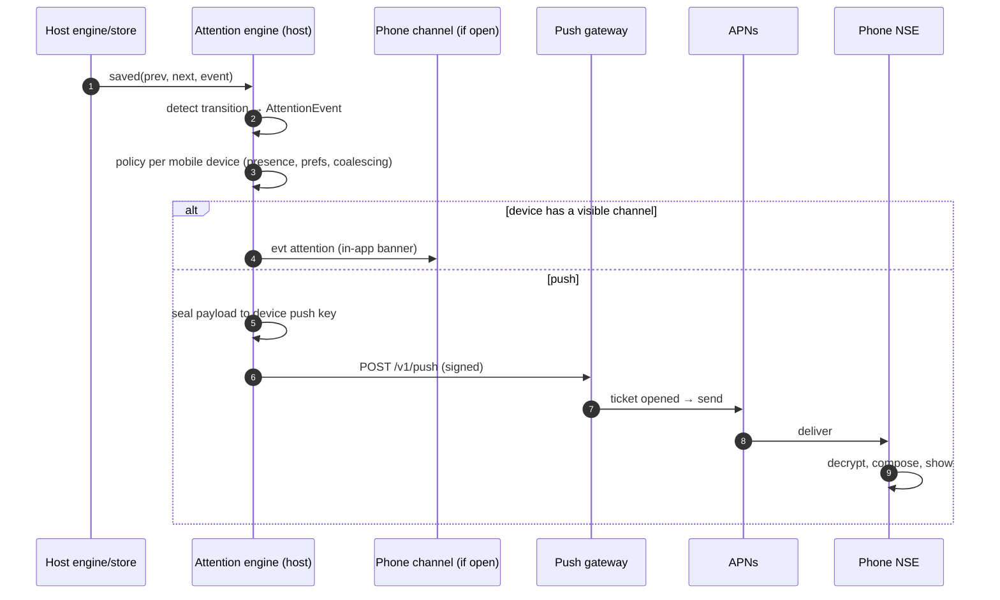

# 8. Notifications

## 8.1 Flow



The host decides because it has the truth: what changed, who is looking, and which
devices want what. Phones and desktops then agree on what counts as "needs you".

## 8.2 Attention events

### Detection

`HostStore.save` gains an observer hook `onSaved(previous, next, event)`. The
attention engine (`host/attention.ts`) compares the two snapshots:

| Kind | Fires when | Dedupe id |
|---|---|---|
| `approval` | `next` has an undecided `block.approval.requestId` that `previous` did not | `sid:approval:<requestId>` |
| `question` | `next.session.pendingQuestion?.requestId` is set and differs from `previous` | `sid:question:<requestId>` |
| `finished` | `previous.status === "running"`, `next.status === "idle"`, and none of the rows below apply. The turn wasn't cancelled by a person (`event.type === "settled" && event.cancelled`) | `sid:finished:<runId>` |
| `failed` | Running → idle, and the turn added a `notice:"error"` block or `event.error` is set | `sid:failed:<runId>` |
| `interrupted` | Running → `interrupted`, including the "Host restarted" sweep at startup | `sid:interrupted:<runId>` |
| `usage_limit` | `next.session.usageLimit` is set and `previous.session.usageLimit` was not | `sid:usage:<runId>` |

- Dedupe ids are kept for 24 h in memory, so a re-save never notifies twice.
- **Resolution signals** clear in-app banners, and delivered notifications on a later
  Android app (§8.8):
  - `approval.resolved`: the approval became decided.
  - `question.resolved`: `pendingQuestion` cleared.
  - `turn.started`: a new run started on that session.

### Event shape

```ts
type AttentionKind = "approval" | "question" | "finished" | "failed" | "interrupted" | "usage_limit";
type AttentionEvent = {
  id: string;                    // dedupe id
  kind: AttentionKind;
  sessionId: string; projectId: string; projectName: string;
  harness: RemoteProvider; sessionTitle: string;
  runId?: string; requestId?: number;
  detail?: string;               // see §8.5, already truncated
  resetsAt?: number;             // usage_limit
  at: number;                    // host Unix ms
  needsInputCount: number;       // host-wide count after this event
};
```

It is sent as `evt attention` on channels and sealed into the push plaintext (§8.5).

## 8.3 Presence

Presence says whether someone is looking, and at what.

| Source | How | Counts as present when |
|---|---|---|
| Phone | `hello.presence`, each `ping.presence`, `presence.update` on change | `visible` was reported within 45 s on an open channel |
| Desktop | `presence.update` over HTTP RPC (new), when focus or the focused remote session changes, and every 30 s while that holds ([10 §10.6](10-desktop-changes.md#106-presence-for-notifications)) | Its window is focused, the user gave input within 120 s, and the last report was within 60 s |

The host keeps `presence[deviceId] = {visible, focusedSessionId, at}` in memory.
A closed channel clears that device's presence.

## 8.4 Policy

For each attention event, and for each **mobile** device with an active push target:

1. **Preferences.** Skip if the device disabled this category, or muted the project
   or the session.
2. **Someone is already looking.** Skip if any device, desktop or phone, is present
   with `focusedSessionId === event.sessionId`:
   - Within the last 60 s for `finished`, `failed`, `interrupted` and `usage_limit`.
   - Within the last 20 s for `approval` and `question`.
3. **This device has the app open.** If the device has a visible channel, send
   `evt attention` there and **don't push**. The app shows an in-app banner unless
   it is showing that session.
4. **Delay `finished`.** Hold a `finished` event for 5 s. If a new turn starts on the
   session within that time, drop it. A queued message dispatching is not "finished"
   from the person's point of view.
5. **Coalesce.**
   - At most one `finished`, `failed` or `interrupted` push per (device, session)
     per 60 s. Later ones in the window replace the pending one.
   - `approval` and `question` are never delayed.
   - Each device has a soft cap of 20 pushes per minute. Beyond it, only approvals
     and questions are sent.
6. **Push.** Seal the payload to the device's push key and batch it into the next
   gateway request. The batch is flushed within 250 ms, with at most 50 messages per
   request.

**Android cleanup (deferred with §8.8).** When a resolution signal arrives (§8.2), the
host also sends a `resolved` push, at normal priority, to Android targets that were
sent the original. The background task then cancels the stale notification. iOS
cleanup is done by the app on foreground (§8.7).

## 8.5 Payload

The plaintext is sealed per device ([03 §3.7](03-identity-and-crypto.md#37-push-payload-encryption)),
1,800 bytes at most:

```ts
type PushPlaintext = {
  v: 1;
  kind: AttentionKind | "resolved" | "test";
  env: string;                   // host environmentId (the phone maps it to its own label)
  sid?: string; pid?: string;
  project?: string;              // project name
  harness?: RemoteProvider;
  title?: string;                // session title            (omitted when preview = minimal)
  detail?: string;               // tool label, question, last text, error (omitted when minimal)
  req?: number; run?: string;
  resetsAt?: number;
  at: number;
  n: number;                     // host-wide needs-input count
  of?: string;                   // for "resolved": the dedupe id being resolved
};
```

**`detail` per kind**, built on the host with shared core helpers:

| Kind | `detail` |
|---|---|
| `approval` | `resolveToolCallDisplay(block)` from `transcriptActivity.ts`, for example "Run: npm test -- --watch=false" or "Edit src/app/App.tsx". Shell commands are truncated to 200 chars |
| `question` | The prompt's `title` or its first question's `prompt`, plus " (+2 more)" when there are several |
| `finished` | The last assistant text of the turn, markdown stripped, collapsed whitespace, ≤ 180 chars |
| `failed` | The error notice text, ≤ 180 chars |
| `interrupted` | The system text, for example "Host restarted. This turn was interrupted…" |
| `usage_limit` | none (`resetsAt` carries the data) |

**Composition on the phone.** It follows the desktop's notification formats
(`notifications.ts:159-224`), which use title "MonoCode", subtitle = session title,
and the body below. iOS already shows the app name above every notification, so the phone uses the session title as the title and moves the project
and machine into the subtitle. The body wording is the desktop's.

| Kind | Title | Subtitle | Body (full) | Body (minimal) |
|---|---|---|---|---|
| `approval` | session title | "{project} · {machine}" | "Approve: {tool title}" (`detail`), or "{Harness} needs your approval" | "{Harness} needs your approval" |
| `question` | session title | "{project} · {machine}" | the question prompt (`detail`), or "{Harness} has a question for you" | "{Harness} has a question for you" |
| `finished` | session title | "{project} · {machine}" | the last reply (`detail`, first paragraph, 240 chars with "…"), or "{Harness} finished" | "{Harness} finished" |
| `failed` | session title | "{project} · {machine}" | "Turn failed: {error}" | "Turn failed" |
| `interrupted` | session title | "{project} · {machine}" | the host's message, e.g. "Host restarted. This turn was interrupted; inspect its work before continuing." | "Turn interrupted" |
| `usage_limit` | session title | "{project} · {machine}" | "Usage limit reached · resets at {time}" | same |
| `test` | "MonoCode" | "{machine}" | "Notifications from {machine} are working." | same |

- The desktop clips bodies to the first paragraph, collapses whitespace, and caps them
  at 240 characters with "…". The host applies the same rule when building `detail`,
  within the 1,800-byte payload budget.
- Strings are in a localisable table, English only in v1.

`{machine}` is the label the person gave the machine on this phone. The app writes an
`env → label` map to shared storage that the extension and background task can
read.

## 8.6 Push targets and registration

- **Register on every channel open** while notifications are on for that host.
  `push.register` carries:
  - the **gateway URL** of the phone's publisher, plus a ticket sealed to that
    gateway ([03 §3.8](03-identity-and-crypto.md#38-push-tickets));
  - the push public key, the categories, the preview mode and the mutes.
  - The host stores them on the device row ([09 §9.4](09-host-changes.md#94-database-migrations)).
  - Re-registration is cheap, and it keeps the token fresh after OS token rotation.
- **Gateway per target.** The host keeps the gateway with each target. It batches
  pushes per gateway and signs each request with its relay key. A host can therefore
  serve MonoCode Dev and MonoCode phones at the same time
  ([13 §13.5](13-testing-and-release.md#135-publishers-and-build-tracks)).
  - The gateway URL must be `https:`. Unless `push.allowPrivateGateways` is on, the
    host refuses gateway hostnames that are IP literals or resolve to loopback,
    private or link-local addresses. A paired phone can't use the host to reach its
    internal network.
  - The first push to a gateway claims the host's room there, with the same key and
    rules as the relay ([07 §7.5](07-relay-and-push-service.md#75-push-gateway)).
- **Lease.** A target expires 30 days after its last registration. The host purges
  expired targets daily.
- **Invalid targets.** A gateway result of `unregistered` or `invalid_ticket` clears
  the target. The phone re-registers on its next connect with a fresh token, if it
  can still get one.
- **Turning off.** Turning notifications off for a host calls `push.unregister`.
- **OS permission revoked.** The phone notices on foreground
  (`UNUserNotificationCenter.notificationSettings()`). It unregisters every host and shows the
  "Notifications are off in Settings" state.
- **Push key rotation** is phone-initiated. A new key is registered on every host,
  and the old private key is kept 7 days.

## 8.7 iOS delivery

- **Notification Service Extension.**
  - The `NotificationService` target in `apps/ios`
    ([16 §16.3](16-ios-native-design.md#163-architecture)). It links MonoChannel for
    the CryptoKit open, and MonoStore's Keychain wrapper.
  - It reads the push private key from the shared keychain access group, for example
    `$(AppIdentifierPrefix)com.monocode.mobile.shared` on the official track.
  - It reads the host label map and per-host badge counts from the App Group, for
    example `group.com.monocode.mobile`. Both names come from the publisher config
    ([13 §13.5](13-testing-and-release.md#135-publishers-and-build-tracks)).
- **Steps:**
  1. Read `e` and `k` from the APNs payload's top level, and the thread from
     `aps.thread-id` ([07 §7.5](07-relay-and-push-service.md#75-push-gateway)).
  2. Decrypt with CryptoKit ([03 §3.7](03-identity-and-crypto.md#37-push-payload-encryption)).
     On any failure, keep the placeholder ("MonoCode" / "New activity") and stop.
  3. Compose title, subtitle and body (§8.5).
  4. Set the presentation:
     - `threadIdentifier = t`.
     - `categoryIdentifier = kind`.
     - `interruptionLevel = .timeSensitive` for approvals and questions, which needs
       the Time Sensitive Notifications capability; `.active` otherwise.
     - `relevanceScore` 1.0 for approvals and questions, 0.5 otherwise.
  5. Put routing data in `userInfo["route"] = "<scheme>://m/<env>/s/<sid>?focus=<kind>:<req>"`.
  6. Store `n` for this host in the App Group. Set `badge` to the sum across hosts.
  7. For `finished`, remove earlier delivered notifications in the same thread that
     are also `finished`, so only the latest stays.
- **Categories**, registered by the app at launch:
  - `approval`: actions **Allow** (`.authenticationRequired`, `.foreground`) and
    **Deny** (`.destructive`, `.foreground`).
  - `question`: **Answer** (`.foreground`).
  - The others have no actions.
  - Every category sets `hiddenPreviewsBodyPlaceholder: "New activity"`, so lock
    screens with previews hidden show nothing private.
- **Cleanup.** On foreground the app removes delivered notifications whose dedupe id
  is resolved according to the current inbox: approval decided, question gone, or a
  newer turn running.

## 8.8 Android delivery (deferred)

Android is out of v1 (D19). This section keeps the design for a later Android app, so
the host and gateway need no change when it comes.

- **Background task.** Data-only FCM messages wake the app's background task **(spike S3)**. It:
  1. Reads the push private key from secure storage.
  2. Decrypts the payload ([03 §3.7](03-identity-and-crypto.md#37-push-payload-encryption)).
  3. Composes and posts the notification.
- **Channels**, created at first launch:

  | Channel id | Name | Importance | Kinds |
  |---|---|---|---|
  | `approvals` | Approvals and questions | HIGH (heads-up, sound) | approval, question |
  | `finished` | Finished turns | DEFAULT | finished |
  | `problems` | Failures and limits | DEFAULT | failed, interrupted, usage_limit |
  | `test` | Test notifications | LOW | test |

- **Ids and grouping.**
  - Approvals: `"{env}:{sid}:approval:{req}"`.
  - Questions: `"{env}:{sid}:question:{req}"`.
  - Others: `"{env}:{sid}:{kind}"`, so the latest replaces the earlier one.
  - All notifications are grouped by `"{env}:{sid}"`.
- **`resolved`** messages cancel the notification named by `of`.
- **Lock screen.** When "Show content on lock screen" is off in app settings, the
  task composes the minimal body for every kind.
- **Background limits.**
  - High-priority FCM messages (approvals, questions, tests) get through Doze.
  - Normal-priority ones may be delayed by Doze, which is acceptable for `finished`.
  - Aggressive OEM battery managers (Xiaomi, Huawei, some Samsung modes) can block
    background starts. The troubleshooting screen links to the OEM's
    battery-optimisation setting and to dontkillmyapp.com.

## 8.9 Tapping and actions

- **Tap.** It opens `route`: the session screen.
  - `focus=approval:<req>` scrolls to the tool block and opens the approval sheet.
  - `focus=question:<req>` opens the question sheet.
  - Cold starts get the response through `UNUserNotificationCenterDelegate`
    `userNotificationCenter(_:didReceive:)` before the first screen. The cached
    transcript paints first, and that host's channel is connected before the others.
- **Allow / Deny actions** (v1):
  - Both open the app. iOS asks for Face ID or the passcode first for Allow.
  - If the notification showed full content, the decision is dispatched at once
    through the outbox, then confirmed with a toast ("Allowed: Run npm test").
  - If it showed minimal content, the approval sheet opens with that choice
    highlighted, and one more tap confirms. A person should never approve something
    they haven't seen.
  - If the approval was resolved in the meantime, the toast says "Already answered
    on another device".
- **Background actions without opening the app** come after v1 **(spike S8)**.

## 8.10 In-app notifications

- `userNotificationCenter(_:willPresent:)` returns `[.list]` while the app is
  active, without `.banner`. The OS doesn't double up with in-app banners.
- **`evt attention` handling.** If the person is on that session, the app does
  nothing beyond a light haptic for approvals and questions. Otherwise it shows an
  in-app banner at the top:
  - Harness icon, title, detail, and a **View** button.
  - The banner disappears after 6 s for `finished`. It stays until dismissed or
    resolved for approvals and questions.
- The **Agents tab badge** shows the total needs-input count across hosts.

## 8.11 Settings

- **Per host** (Host → Notifications):
  - On/off.
  - Categories: Approvals and questions; Finished; Failures and limits.
  - Preview: Full or Minimal.
  - Muted projects, as a list of toggles.
- **Per session**, from the session menu: Mute notifications (stored in the host's
  `mutedSessions` for this device).
- **Global** (Settings → Notifications):
  - The system permission status, with a link to the OS settings.
  - "Show content on lock screen", which points to the system's preview setting.
  - Sounds.
  - **Send test notification**, which picks a host and calls `push.test`.
  - **Troubleshooting**: per-host registration state, last push received (time and
    kind), and whether Background App Refresh is on.

## 8.12 Badge

- **iOS.** The badge is the sum of `n` across hosts. The extension keeps it current
  from pushes. On foreground the app recomputes it from `inbox.list` results and
  calls `UNUserNotificationCenter.setBadgeCount(_:)`.
